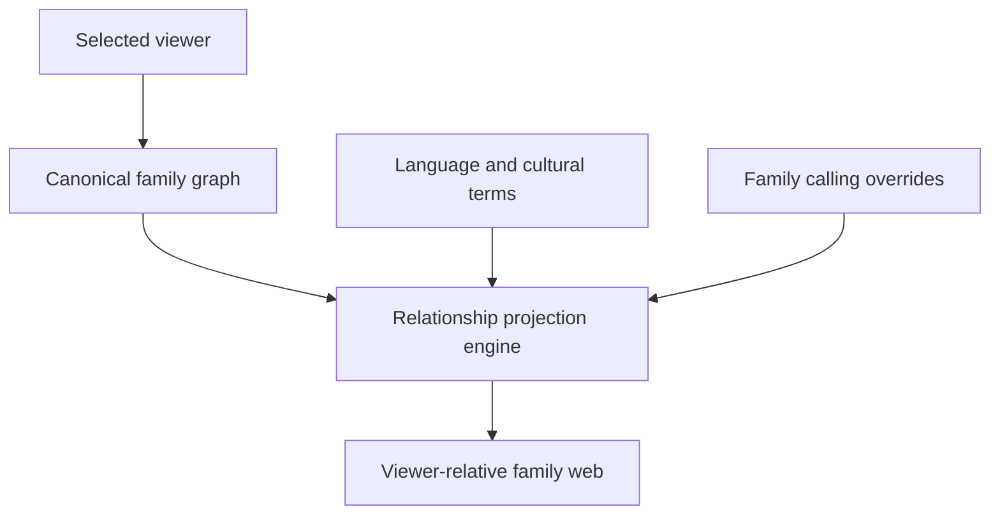
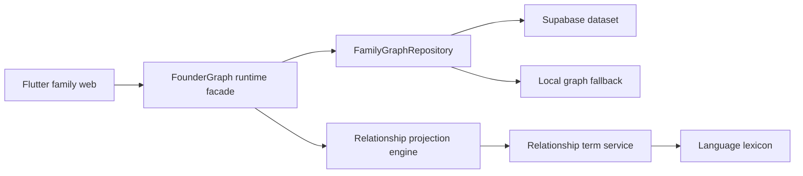

# Vamsha

**A viewer-centric, culturally intelligent family relationship platform.**

Traditional family trees answer:

> Who is connected to whom?

Vamsha answers:

> Who is this person to me?

The same person can be a daughter, sister, aunt, spouse, or daughter-in-law
depending on who is viewing the family. Vamsha keeps one canonical family graph
and projects relationships from the selected viewer's perspective.

## Current Project Output

Vamsha currently runs as a responsive Flutter web application backed by
Supabase, with a checked-in offline graph fallback.

The working founder experience includes:

- A zoomable and pannable family web
- Viewer switching across multiple family members
- Responsive person profiles opened directly from the family canvas
- Automatic relationship projection from graph structure
- Telugu cultural calling names alongside English relationships
- Family-specific calling memories such as `Pedhananna`, `Chelli`, and `Pinni`
- Separate married-person cards grouped as a couple
- Paternal, maternal, spouse, sibling, and descendant branches
- Person aliases, known-as names, sibling order, mother tongue, fluent
  languages, location, and optional cultural metadata
- Supabase loading at application startup
- Read-only public access to the active founder dataset through Row Level
  Security
- Automatic local fallback when Supabase is unavailable
- Web and phone viewport tests

The current milestone has **28 passing Flutter tests** and a clean
`flutter analyze`.

## The Core Idea

A relationship is not a permanent label on a person. It is a projection:

```text
Relationship projection = viewer + family graph + cultural context
```

For example, one person may be shown as:

| Viewer | Projected relationship |
| --- | --- |
| Her child | Mother |
| Her spouse | Spouse |
| Her grandchild | Grandmother |
| Her parent-in-law | Daughter-in-law |

Vamsha also separates the canonical relationship from the family's preferred
calling name:

| Canonical relationship | English display | Cultural calling |
| --- | --- | --- |
| `younger_sister` | Sister | Chelli |
| `maternal_aunt_mothers_younger_sister` | Maternal Aunt | Pinni |
| `paternal_uncle_fathers_elder_brother` | Paternal Uncle | Pedhananna |

This lets the graph remain structurally correct while preserving how a family
actually speaks.

## Viewer-Centric Family Web

Selecting a different viewer recalculates:

- The person shown at the center
- Parent, child, sibling, spouse, and in-law labels
- Generation bands relative to that viewer
- Mother-tongue relationship terms
- Family-specific overrides
- The visible branch and camera focus



Generations are viewer-relative:

```text
Ancestors (+N)
Parents (+1)
You (0)
Children (-1)
Descendants (-N)
```

Vamsha does not store people as "Generation 1" or "Generation 2" because the
generation changes when the viewer changes.

## Architecture



### Application

- **Flutter** provides one codebase for web and future Android/iOS releases.
- **InteractiveViewer** provides zoom and pan behavior.
- A custom layout model positions family units, people, connectors, generation
  labels, and viewer focal points.
- The relationship engine derives labels from canonical parent and spouse
  relationships.

### Data

- `FamilyGraphData` is the serializable graph boundary.
- `PersonEntity` stores identity-independent person metadata.
- `FamilyUnit` groups two partners.
- `RelationshipEdge` stores canonical graph connections.
- `ViewerRelationshipOverride` stores family-specific calling memories.
- `FamilyGraphRepository` hides whether data came from Supabase or local code.

### Backend

- **Supabase/PostgreSQL** stores the active versioned founder graph.
- Row Level Security permits public clients to read only the active
  `founder_family` dataset.
- Browser clients receive only the Supabase publishable key.
- Service-role credentials are never stored in Flutter, Markdown, or Git.

See [Architecture](docs/ARCHITECTURE.md) and
[Data Model](docs/DATA_MODEL.md) for the deeper design.

## Repository Structure

```text
vamsha-platform/
├── backend/
│   └── supabase/
│       ├── migrations/       # PostgreSQL schema, lexicon, and graph seed
│       └── README.md
├── docs/                     # Product and engineering decisions
├── mobile_app/
│   ├── assets/data/          # Generated relationship term data
│   ├── lib/features/family/  # Graph, projection, layout, and UI
│   ├── test/                 # Domain, repository, layout, and widget tests
│   └── tool/                 # Graph export and migration generators
├── scripts/
│   └── run-web.sh
├── .env.example
└── Makefile
```

## Run Locally

### Prerequisites

- Flutter with Dart 3 support
- Google Chrome
- Git
- Optional: access to the Vamsha Supabase project

Confirm Flutter is available:

```bash
flutter --version
```

### Supabase-backed mode

Create the ignored local configuration:

```bash
cp .env.example .env.local
```

Add the Supabase URL and **publishable** key to `.env.local`, then run:

```bash
make get
make run
```

The configuration file uses JSON because Flutter reads it through
`--dart-define-from-file`:

```json
{
  "SUPABASE_URL": "https://your-project.supabase.co",
  "SUPABASE_PUBLISHABLE_KEY": "sb_publishable_replace_me"
}
```

### Offline fallback mode

The app can run without Supabase by starting Flutter directly:

```bash
cd mobile_app
flutter run -d chrome
```

Without Dart defines, Vamsha installs the checked-in founder graph.

## Verify the Project

```bash
make analyze
make test
git status
```

The repository layer is tested for:

- Graph JSON serialization and restoration
- Supabase failure fallback
- Runtime graph installation
- Relationship projection
- Language and cultural term selection
- Viewer-relative family layout
- Responsive phone positioning
- Primary family-web navigation

See [Development Guide](docs/DEVELOPMENT.md) for the complete workflow.

## Supabase Safety

`.env.local` is ignored by Git. Only `.env.example` is committed.

Safe in the frontend:

- Supabase project URL
- Supabase publishable key

Never commit:

- Service-role or secret keys
- Database passwords
- Private access tokens
- Unapproved private family records or media

The current founder graph is readable by the public client because it powers
the public prototype. Private user-created family graphs will require
authenticated, family-scoped RLS policies before launch.

## Current Status

| Area | Status |
| --- | --- |
| Viewer-centric family canvas | Working |
| Responsive viewer focus | Working |
| Relationship projection | Working |
| Telugu and English calling display | Working |
| Family-specific calling overrides | Working |
| Supabase graph loading | Working |
| Offline fallback | Working |
| Person profile inspection | Working |
| Automated Flutter tests | Working |
| Editable person profiles | Next |
| Authenticated private family spaces | Planned |
| Collaborative editing and invitations | Planned |
| Memories and family social features | Future |

The next engineering milestone is to replace read-only seeded data with safe,
authenticated profile and relationship editing.

See the [Roadmap](docs/ROADMAP.md) for sequencing.

## Product Direction

Vamsha begins with family relationship intelligence, but its architecture is
intended to grow into:

1. Collaborative private family graphs
2. Identity claims and invitation-based onboarding
3. Family memories, stories, photos, and life events
4. Private family social spaces
5. Relationship explanations and AI-assisted family discovery

The relationship graph remains the foundation. Social and AI features should
build on trusted people, relationships, permissions, and provenance rather
than becoming disconnected feeds.

## Documentation

- [Architecture](docs/ARCHITECTURE.md)
- [Data Model](docs/DATA_MODEL.md)
- [Development Guide](docs/DEVELOPMENT.md)
- [Product Roadmap](docs/ROADMAP.md)
- [Product Vision](docs/PRODUCT_VISION.md)
- [Privacy Model](docs/PRIVACY_MODEL.md)
- [Identity Architecture](docs/IDENTITY_ARCHITECTURE.md)
- [Relationship Intelligence Overview](docs/relationship-intelligence/VRI_V1_OVERVIEW.md)
- [Supabase Backend](backend/supabase/README.md)

## Founder

Vamsha is founded and developed by **Hemanth Kumar**, a Senior Site
Reliability Engineer and DevOps leader building a culturally aware way for
families to understand and preserve their relationships.

[LinkedIn](https://www.linkedin.com/in/hemanthkumarn/)

## Project Stage

Vamsha is an actively developed prototype. Interfaces, schemas, and product
decisions may change as editing, privacy, collaboration, and production
deployment are implemented.
