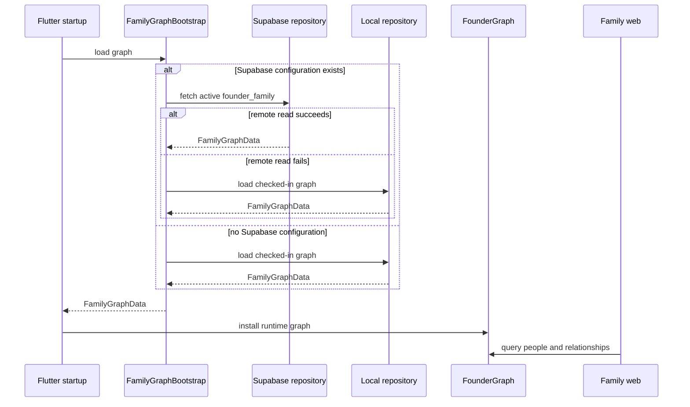
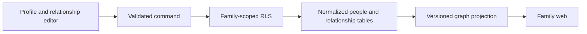

# Vamsha Architecture

## Purpose

Vamsha models a family once and renders it differently for every viewer.

The architecture separates:

- A person from a platform user account
- Canonical graph facts from viewer-relative labels
- English relationship names from cultural calling names
- Remote persistence from runtime graph behavior
- Public prototype data from future private family spaces

## Current Runtime



## Application Layers

### Presentation

Primary modules:

- `founder_family_web_screen.dart`
- `family_web_layout.dart`
- `person_card.dart`
- `person_profile_panel.dart`
- `married_couple_card.dart`
- `relationship_connector.dart`

The family web uses a large logical canvas inside `InteractiveViewer`. Layout
coordinates, connector paths, generation labels, and viewer focal points are
kept separate from relationship inference.

Person cards open a responsive profile surface. Desktop uses a right-side
panel; compact screens use a bottom sheet. Changing the active viewer remains
an explicit action inside the profile or viewer toolbar.

### Domain

`RelationshipProjectionService` derives the target person's relationship to a
selected viewer.

Inputs:

- Viewer ID
- Target person ID
- Canonical graph
- Gender and sibling order
- Language profile
- Family-specific viewer override

Output:

- Canonical relationship code
- English relationship
- Optional cultural relationship

Relationship calculation prefers:

1. A precise family-specific override
2. A relationship inferred from graph paths
3. A localized term selected from the viewer's mother tongue

### Data

`FamilyGraphRepository` is the application boundary for graph loading.

Implementations:

- `SupabaseFamilyGraphRepository`
- `LocalFamilyGraphRepository`
- `FallbackFamilyGraphRepository`

`FamilyGraphBootstrap` chooses the repository at startup. UI and relationship
code do not need to know whether the graph came from PostgreSQL or local Dart
data.

### Persistence

The current read path uses:

```text
public.family_graph_datasets
```

Each row contains:

- Dataset key
- Schema version
- JSON graph data
- Active state
- Published and updated timestamps

This atomic dataset is appropriate for the current read-only founder
prototype. Existing normalized tables support the direction for future
editable people, relationships, terms, identity claims, spaces, and
governance.

## Security Boundary

The Flutter app may receive:

- Supabase project URL
- Supabase publishable key

The Flutter app must never receive:

- Service-role key
- Database password
- Private server credentials

Row Level Security currently permits anonymous and authenticated clients to
read only the active `founder_family` dataset. Writes are restricted to the
service role.

Before user-created families are enabled, access must become family-scoped and
authenticated. Public founder data and private family data must not share a
broad read policy.

## Offline Behavior

The checked-in founder graph is a deliberate fallback, not a second source of
truth for production editing.

It provides:

- Local development without backend access
- Demonstration resilience
- Deterministic test fixtures
- Recovery when Supabase cannot be reached

Graph export and SQL migration generation tools reduce drift between the local
fixture and the remote dataset.

## Responsive Strategy

The graph uses stable logical coordinates instead of resizing cards based on
viewport width. The camera then centers the selected viewer for the available
screen.

This preserves:

- Connector alignment
- Card dimensions
- Family grouping
- Viewer focus
- Pan and zoom behavior

Tests cover graph references, couple rendering, viewer focal points, and a
phone viewport.

## Architectural Rules

1. `UserAccount` is not `PersonEntity`.
2. Phone and email are contact methods, not human identity.
3. Canonical graph edges do not contain viewer-relative labels.
4. Cultural terms are display intelligence, not replacement graph facts.
5. Family-specific language exceptions must include viewer and target context.
6. UI layout must not become the source of relationship truth.
7. Secret credentials must not enter Flutter or Git.
8. New social features must inherit graph privacy and ownership rules.

## Near-Term Evolution

The next architecture step is a write model for authenticated editing:



This keeps editing normalized and auditable while allowing the client to load
an efficient graph projection.
